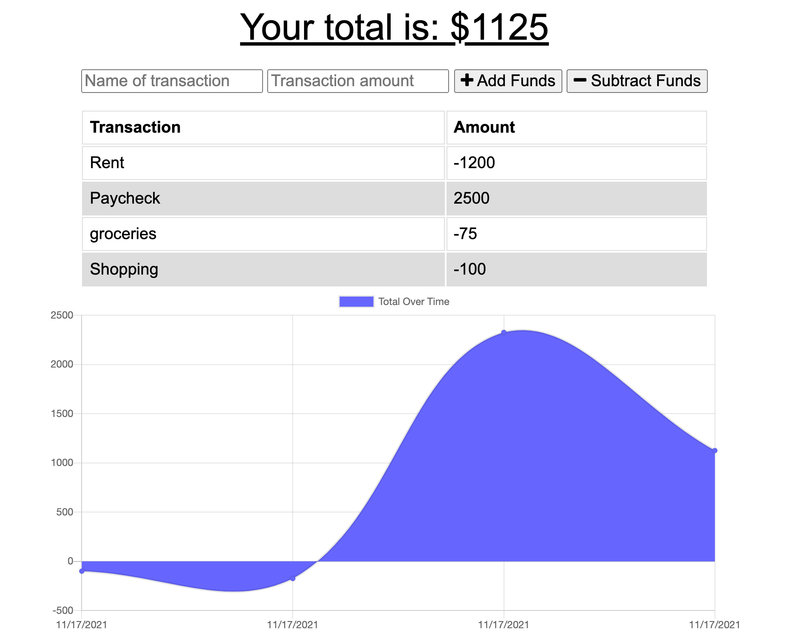

# PWA_BUDGET_TRACKER

## Description: 
 The purpose of this application was to added the Progressive Web Application (PWA) feature to a budget tracker. With use of the PWA use has the ability to:
    - Add/Subtract funds when user is online
    - Add/Subtract funds when user is offine
    - When user switched offline and adds data the database will be updated once the application is back online.

## Table of Contents 

* [Installation](#installation)
* [Usage](#usage)
* [License](#license)
  
## Installation 
Please access the application via the link below. 

https://christa-baccas.github.io/PWA_BUDGET_TRACKER/

## ScreenShot 
 

## Testing 
No Testing included for this project.

## License 
MIT 

## Questions: 
If you have any questions, please feel free to contact me at:
  Email Address: christa.baccas@gmail.com
  Github Account: https://github.com/christa-baccas
